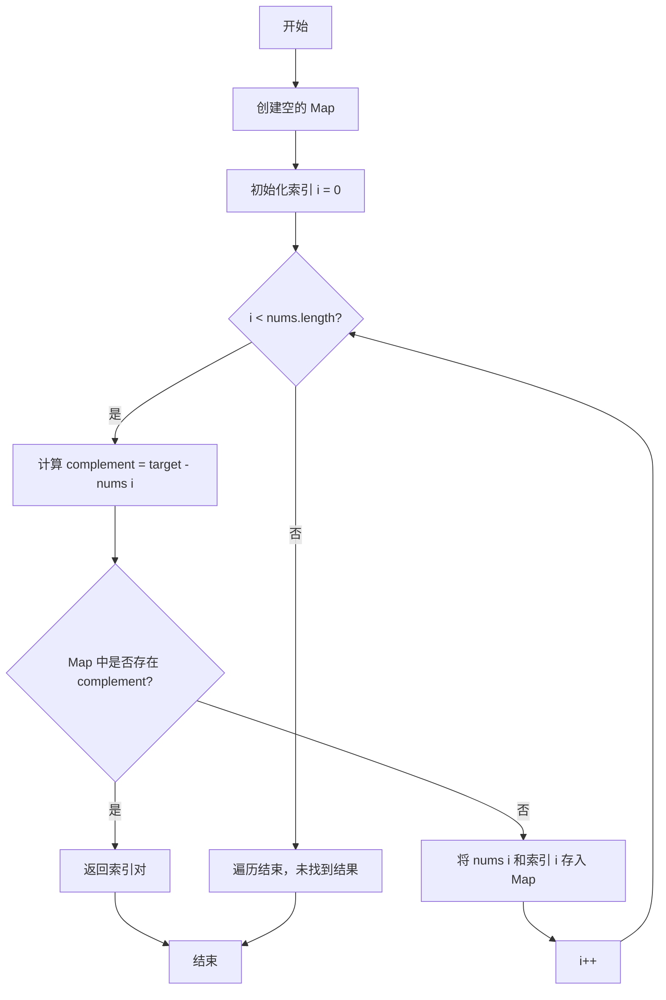

/**
 * @param {number[]} nums
 * @param {number} target
 * @return {number[]}
 */
var twoSum = function(nums, target) {
  let map = new Map()
  for(let i=0;i<nums.length;i++){
      if(map.has(target-nums[i])) return [i,map.get(target-nums[i])]
      else map.set(nums[i],i)
  }
};

## 两数之和算法流程图

### 算法说明

1. **初始化**：创建一个空的 Map 用于存储已遍历的数字及其索引
2. **遍历数组**：从左到右遍历输入数组 nums
3. **计算补数**：对于当前元素 nums[i]，计算其补数 complement = target - nums[i]
4. **查找补数**：检查 Map 中是否已存在该补数
   - 如果存在，说明找到了两个数的和等于目标值，返回它们的索引
   - 如果不存在，将当前数字和索引存入 Map，继续遍历
5. **返回结果**：返回两个数字的索引数组

**时间复杂度**：O(n) - 只需要遍历一次数组  
**空间复杂度**：O(n) - 最坏情况下需要存储所有元素到 Map 中
