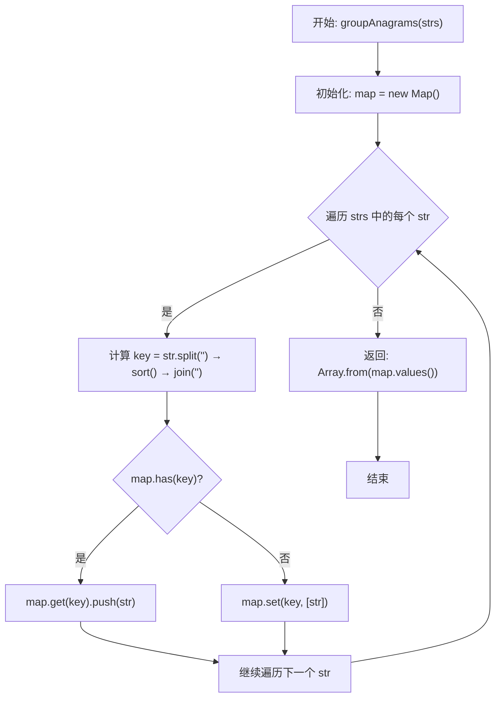

/**
 * @param {string[]} strs
 * @return {string[][]}
 */
var groupAnagrams = function (strs) {
  const map = new Map()
  for (let str of strs) {
    let key = str.split('').sort().join('')
    if (map.has(key)) {
      map.get(key).push(str)
    } else {
      map.set(key, [str])
    }
  }
  return Array.from(map.values())
}
### 流程图（Mermaid）

### 关键要点
- **分组依据**：对每个字符串进行字符排序后的结果作为 `key`，相同字母异序词会得到相同 `key`。
- **数据结构**：`Map<string, string[]>` 用于将同组字符串聚合到一个数组中。
- **返回值**：`string[][]`，每个子数组表示一组同字母异序词。
- **时间复杂度**：约为 O(n · k · log k)，n 为字符串数量，k 为单个字符串长度（由排序主导）。
